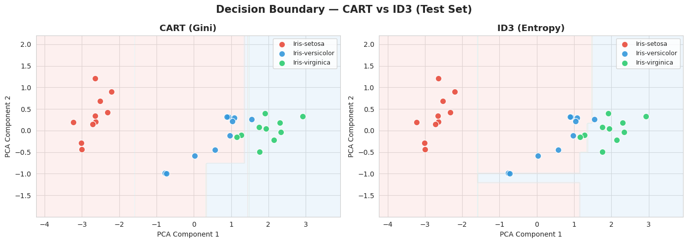
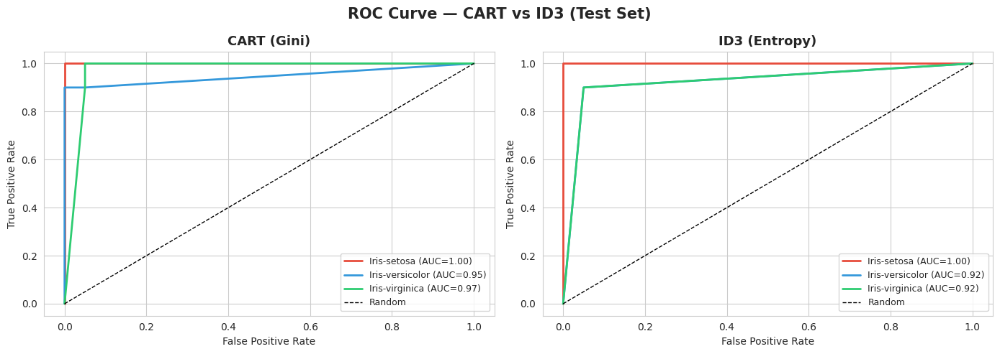
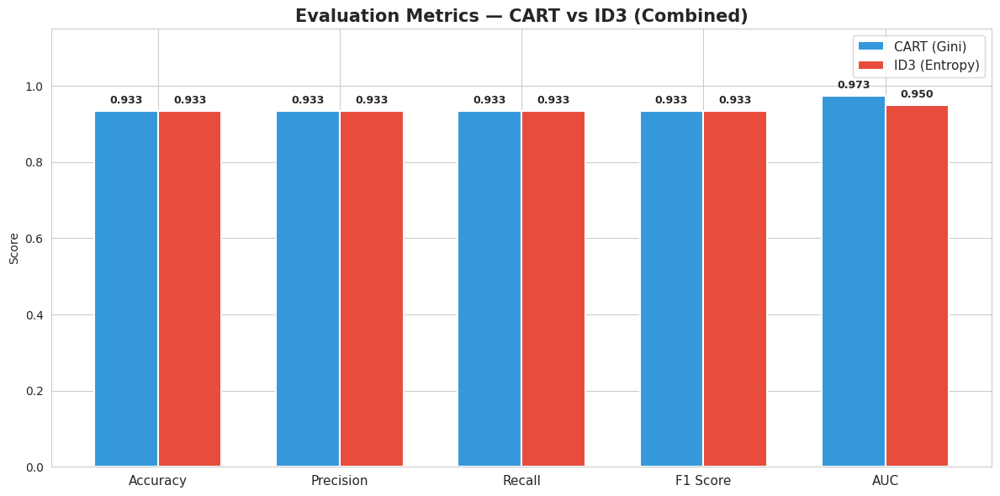
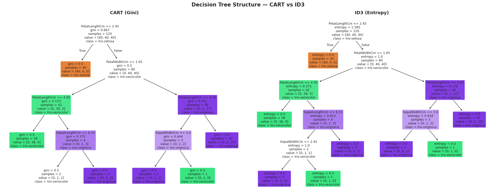

# K-Means Clustering — Customer Segmentation
**Student ID:** 220143  
**Algorithm:** K-Means Clustering  
**Dataset:** Mall Customers Dataset  

---

## Project Description
This project applies K-Means Clustering to segment mall customers based on their **Annual Income** and **Spending Score**. The optimal number of clusters was determined using the **Elbow Method**.

---

## Repository Structure

---

## Elbow Method — Finding Optimal K
The elbow curve below shows that **K=5** is the optimal number of clusters.

---

## Cluster Scatter Plot
The scatter plot below shows the 5 customer segments with centroids marked as ★

---

## Custom Data Prediction
10 real-world customers were surveyed and assigned to clusters using the trained model.

---

## Cluster Interpretations

| Cluster | Profile | Description |
|---------|---------|-------------|
| 0 | High Income, Low Spender | Earn well but spend conservatively. Saving-oriented customers. |
| 1 | Low Income, Low Spender | Budget-conscious with limited purchasing power. |
| 2 | Average Customer | Middle-income moderate spenders. Most stable segment. |
| 3 |  High Income, High Spender | Wealthy customers who spend freely. Prime VIP targets. |
| 4 |  Low Income, High Spender | Impulsive buyers despite lower income. Respond to promotions. |

---

## 🔗 Links
- **Colab Notebook:** https://colab.research.google.com/drive/1NVfBFfRvCfpY5C_YwhTXGPHrZbgDGSyh?usp=sharing
- **GitHub Repo:** https://github.com/rubyat43/220143_DT_-_K_Means_Clustering

---

# Decision Tree Implementation — CART vs ID3
**Student ID:** 220143  
**Algorithm:** CART (Gini) vs ID3 (Entropy)  
**Dataset:** Iris Dataset  

---

## Project Description
This project implements and compares two Decision Tree algorithms — CART using Gini criterion and ID3 using Entropy criterion. Both models are tuned using Cross-Validation with GridSearchCV to find the best max_depth and min_samples_split parameters.

---

## Repository Structure

---

## Visualizations

### Confusion Matrix — CART vs ID3

### Decision Boundary — CART vs ID3

### ROC Curve — CART vs ID3

### Evaluation Metrics — CART vs ID3

### Decision Tree Structure

---

## Model Comparison

Metric        CART (Gini)  ID3 (Entropy)
----------------------------------------
Accuracy           0.9333         0.9333
Precision          0.9333         0.9333
Recall             0.9333         0.9333
F1 Score           0.9333         0.9333
AUC                0.9733         0.9500

---

## 🔗 Links
- **Colab Notebook:** https://colab.research.google.com/drive/15JyVCwIalZNsjs83LjY7KayMoOs75Ftn?usp=sharing
- **GitHub Repo:** https://github.com/rubyat43/220143_DT_-_K_Means_Clustering
