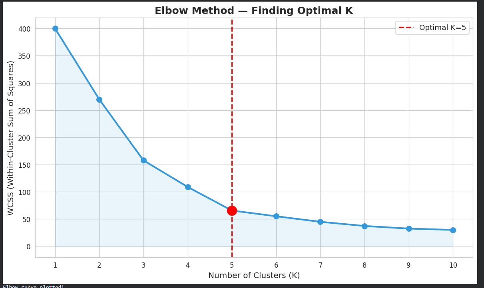
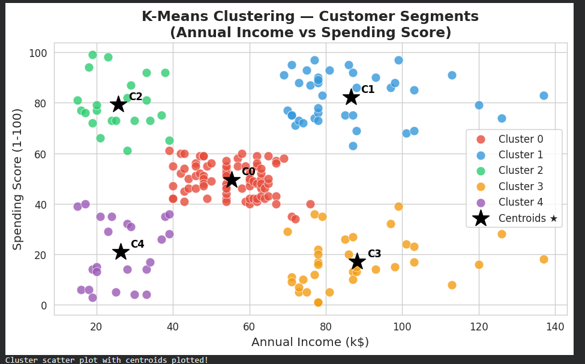
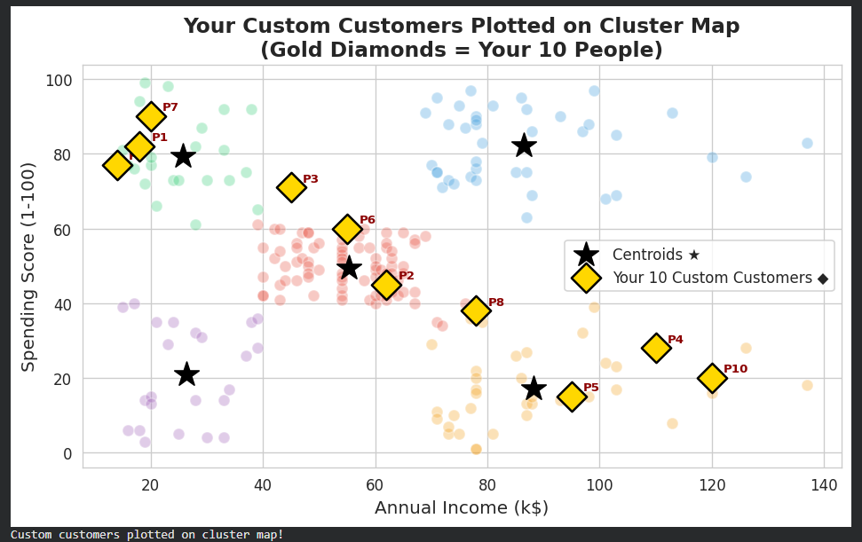

#  K-Means Clustering — Customer Segmentation
**Student ID:** 220143  
**Algorithm:** K-Means Clustering  
**Dataset:** Mall Customers Dataset  

---

##  Project Description
This project applies K-Means Clustering to segment mall customers based on their Annual Income and Spending Score. The optimal number of clusters was determined using the Elbow Method.

---

##  Repository Structure

---

## Visualizations

### Elbow Method

### Cluster Scatter Plot

### Custom Customers Prediction

---

##  Cluster Interpretations

| Cluster | Profile | Description |
|---------|---------|-------------|
| 0 |  High Income, Low Spender | Earn well but spend conservatively. Saving-oriented customers. |
| 1 |  Low Income, Low Spender | Budget-conscious with limited purchasing power. |
| 2 |  Average Customer | Middle-income moderate spenders. Most stable segment. |
| 3 |  High Income, High Spender | Wealthy customers who spend freely. Prime VIP targets. |
| 4 |  Low Income, High Spender | Impulsive buyers despite lower income. Respond to promotions. |

---

## 🔗 Links
- **Colab Notebook:** https://colab.research.google.com/drive/1aC7cKGISX1NFwZPo4v3FuKi5nBYtxdWP?usp=sharing
- **GitHub Repo:** https://github.com/rubyat43/220143_K_Means_Clustering
